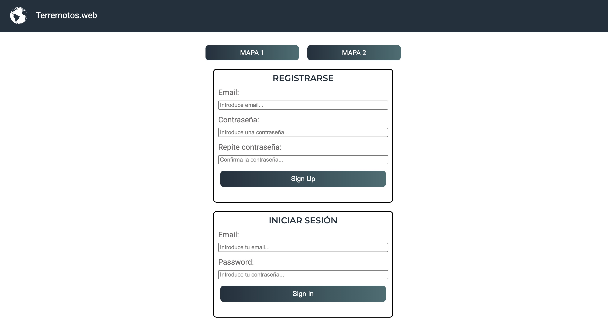
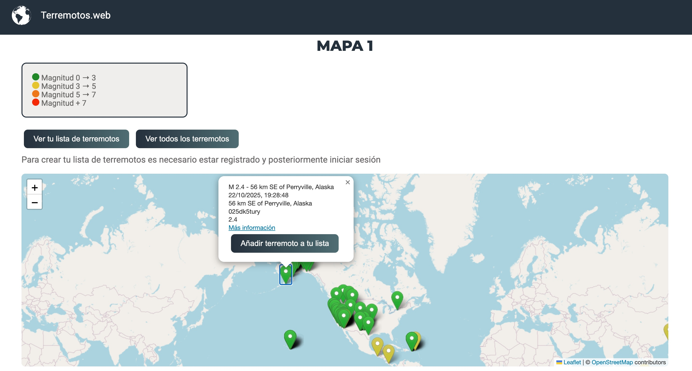
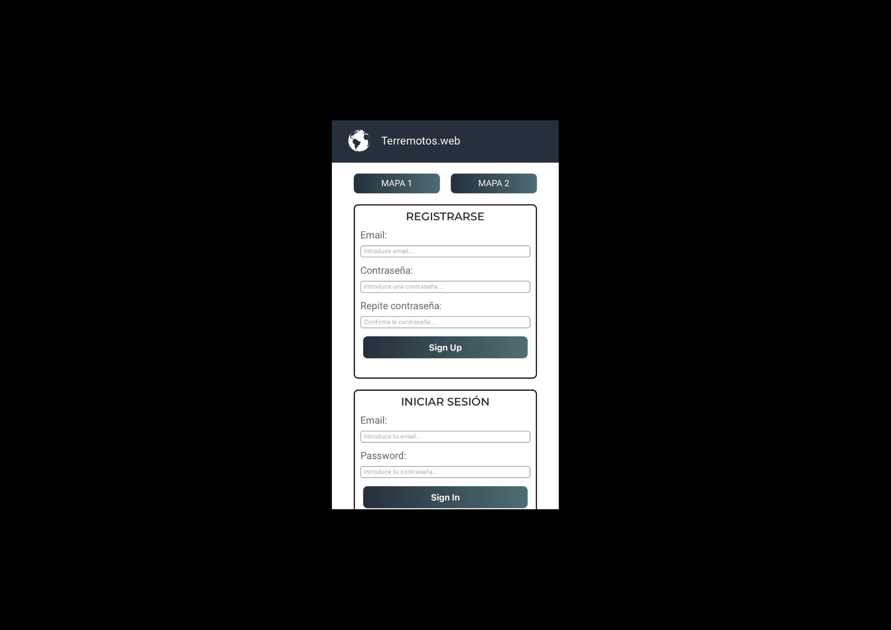

# WEB DE TERREMOTOS    🌏🪨💥
En este proyecto, el objetivo principal era la creación de una página web de terremotos. Los datos de estos terremotos han sido proporcionados por una API. Con esta información he creado dos mapas en los que se indican con marcadores cada terremoto y sus datos. Si te registras e inicias sesión, en el primer mapa, podrás añadir a tu lista los terremotos que selecciones, ver tu lista y eliminar los que ya no quieras.En el segundo mapa podrás filtrar los terremotos por fecha y magnitud.
Los usuarios que se registren se guaradarán en Firebase.

## Tecnologías usadas

- HTML5
- CSS3
- ES6
- Manipulación del DOM

## Objetivo del proyecto 🔎

- Manipulación dinámica del DOM
- Crear una página SPA
- Manejo de ES6
- Peticiones HTTP a APIs
- APIs HTML5: Uso de Mapas, etc...
- Uso de Firebase: Auth, Storage, Firestore
- Gestión del proyecto con  Github 
- Código limpio, buenas prácticas
- Diseño responsive
- Filtros de búsqueda
- Autenticación de usuario
- Validación con Regex
- Spinner de carga
- README bien documentado
- Desplegar la app en gitHub Pages y añadir URL al README

## Capturas de pantalla  📸






## Cómo ejecutar el proyecto 📁

1. Clonar el repositorio:

```

git clone [https://luciaaroca.github.io/terremoto/](https://luciaaroca.github.io/terremoto/)

```

2. Abrir el archivo `index.html` en el navegador.

### Proyecto desplegado

Puedes ver el proyecto online en:  
https://luciaaroca.github.io/terremoto/


## Estructura del proyecto

```

/assets - imágenes 
/css - hoja de estilos principal
index.html - archivo principal
/js - archivo script.js
readme.md - documentación


```

## Autor ✍🏽

- Nombre: Lucía Aroca Solís
- LinkedIn: https://www.linkedin.com/in/luc%C3%ADa-aroca-sol%C3%ADs-b652552b4/
- GitHub: https://github.com/luciaaroca

